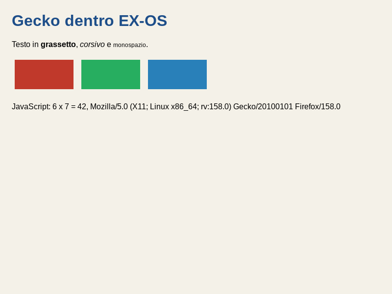
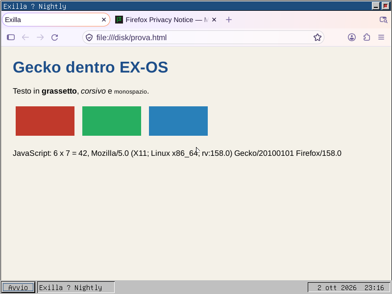
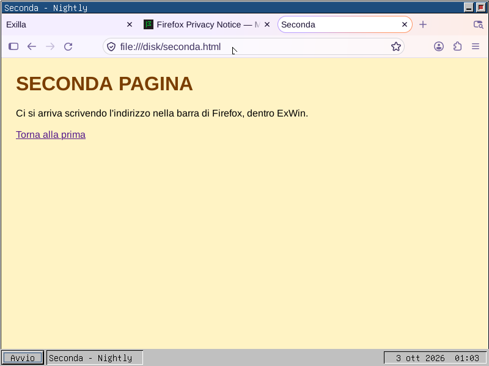

# Exilla — Firefox portato su EX-OS

Exilla e' il browser completo di EX-OS: il motore Gecko di Mozilla Firefox,
portato. **EXBrowser resta** il browser leggero del sistema (documentazione,
manuali, siti semplici); Exilla serve dove serve un motore intero.

- **Il nome**: il marchio «Firefox» e il logo sono di Mozilla e una build non
  ufficiale non li puo' usare. Si parte dal branding neutro dell'albero
  (`browser/branding/unofficial`) e se ne fa uno nostro, `exilla`.
- **La licenza**: MPL 2.0. Si ridistribuisce modificato pubblicando i sorgenti
  dei file che cambiamo: sono le patch di questa directory.
- **Dove va**: non sul CD di base. Sulla ISO degli strumenti, e come pacchetto
  del repository di rete di `netupdate`.
- **Dove si compila**: su una macchina con molta memoria (Core i5 di quarta
  generazione, 32 GB, Debian 12). Il collegamento di `libxul` chiede oltre
  16 GB.

> **Stato al 24 settembre 2026: analisi, niente ancora costruito.** Questo file
> e' il piano, con i dati misurati sull'albero. Ogni tappa, quando e' fatta,
> lascia qui il comando che la rifa'.

## Diario delle tappe

### 28 settembre 2026 — tappa 0 (gli attrezzi) e i primi due passi di Rust

Si lavora sul PC di compilazione (I5SVRDEB: Core i5, 4 core, 31 GB, Debian 12,
glibc 2.36), mentre l'altro PC segue la coda: vedi
`ISTRUZIONI-SECONDO-PROFILO.md` e `scambio.txt` (qui si firma **claude-B**).

- **La toolchain condivisa non parte qui**: `cross_build/exos-cross` (GCC 17,
  C e C++, con libstdc++ per EX-OS) e' nata su Debian 13 e vuole GLIBC 2.38.
  Le sue librerie PER EX-OS vanno benissimo; vanno rifatti solo i programmi
  che girano sull'host. Lo fa `tools/exilla/toolchain-questa-macchina.sh`, in
  `cross_build/<macchina>/exos-cross`, senza toccare quella condivisa.
  **Fatta e provata**: binutils 2.44 e GCC 17 (C, C++, LTO) per questa
  macchina, venti minuti di compilazione su 4 core.
- **Il C++ di Mozilla gira dentro EX-OS**: `tools/exilla/prova-cxx.sh`, 5 su 5
  piu' il distruttore globale. Compilato come Gecko (-fno-exceptions
  -fno-rtti): i COSTRUTTORI GLOBALI partono prima di main (lib/libc_avvio.c
  percorre __init_array), new/delete e le virtuali, std::string, std::vector
  + std::sort, std::map; all'uscita i distruttori globali. ! Il binario pesa
  1,3 MB: libstdc++ e' statica, e std::string/std::map ne tirano dentro molto.
  Per ora non conta; conterà per libxul.
- **Rust gira dentro EX-OS** (@RUST-0 e @RUST-1): `tools/rust-exos/prova.sh`.
  Firefox non si costruisce senza Rust — nemmeno SpiderMonkey da solo — quindi
  e' sul cammino critico: vedi `tools/rust-exos/leggimi.md`.
- **Il disco**: su questo PC restano 28 GB. Una compilazione di Firefox ne
  vuole 30–40: prima della tappa 6 va liberato spazio o usato un altro disco.

### 28 settembre 2026 — tappa 1: i fili POSIX (@PTHREAD), kernel 0.222

**Fatta e provata**: `tools/exilla/prova-pthread.sh`, 15 su 15 dentro EX-OS.

- **Libc**: `<pthread.h>` e `<semaphore.h>` sopra i fili che c'erano gia'
  (thread_crea, il lucchetto che dorme, le condizioni): create/join/detach,
  lucchetti normali, ricorsivi e con controllo, condizioni sui due orologi,
  rwlock, once, chiavi con distruttori, `clock_gettime`. errno per filo fino a
  64 fili.
- **Kernel 0.222**:
  - un filo che eseguiva PER PRIMO una pagina di codice moriva di page fault:
    il caricamento su richiesta cercava i segmenti nel PCB del filo, che non
    li ha (sono del capogruppo);
  - `SYS_THREAD_STACCA` (217): un filo staccato lo raccoglie init;
  - `SYS_THREAD_PILA` (218): fondo e cima della pila, per `pthread_getattr_np`
    (SpiderMonkey ci misura la ricorsione);
  - 128 processi, 64 fili per programma, 2 MB di riserva di pila per filo.
- **I ponti di libc.so per impronta** (FNV-1a) invece che per nome: la tabella
  dei nomi non stava piu' sul floppy.

Come si rifa', su questa macchina:

    tools/exilla/costruisci-privato.sh            # kernel, libc.so, ISO privata
    tools/gcc-exos/prepara-cross.sh "$PWD/cross_build/<macchina>/exos-cross"
    tools/exilla/prova-pthread.sh

! **IL SECONDO COMANDO NON E' FACOLTATIVO**: i programmi di prova si collegano
alla `libc.a` della toolchain, non a quella della copia privata. Senza, la prova
gira col kernel nuovo e la libc vecchia — ed e' successo: i fili staccati si
fermavano a 63 perche' il vecchio `pthread_create` non lo diceva al kernel.

! **La costruzione e' privata** (`cross_build/<macchina>/costruzione-sistema`,
fuori da MEGA): `make BUILD_DIR=... DIST_DIR=...` NON basta, perche'
`tools/mkfloppy.sh` scrive `dist/` per nome fisso.

### 29 settembre 2026 — la `std` di Rust (@RUST-STD), kernel 0.225

**Fatta e provata**: `tools/rust-exos/prova-std.sh`, 29 su 29 dentro EX-OS —
file, directory, ambiente, tempo, thread, `Mutex`, `Condvar`, canali,
`RwLock`, `thread_local!`. EX-OS è un bersaglio **unix** che nella `std` si
comporta come NuttX: il perché e il come stanno nel passo 3 di
`tools/rust-exos/leggimi.md`.

Cosa ha trovato nel sistema, ed è sistemato:
- `struct timespec` con `tv_sec` a 32 bit: ora `time_t`, come POSIX;
- `stat()` e `poll()` rendevano `-errno` invece di `-1`;
- `mkdir` con il genitore mancante rispondeva `EIO` (kernel 0.225);
- la `libc.a` della toolchain era compilata per i686 (`cmov`), non per il
  Pentium MMX: `tools/gcc-exos/prepara-cross.sh` ora passa `-march`;
- `strerror_r` mancava.

Prove rifatte sul CD nuovo, tutte verdi: `prova-pthread.sh`, `prova-cxx.sh`,
`tools/rust-exos/prova.sh`, `polltest`, `libctest` (le stesse 206 di prima;
le 15 che falliscono dal CD scrivono in `/`, che lì è in sola lettura).

### 29 settembre 2026 — i socket BSD (@SOCKET-BSD), kernel 0.226

**Fatti e provati**, in C e in Rust, con la rete vera di QEMU:

    tools/exilla/prova-socket.sh        # C: 23 su 23
    tools/rust-exos/prova-rete.sh       # std::net: 9 su 9

Client e servitore TCP (100 000 byte andata e ritorno), UDP, `poll`, modo non
bloccante, `SO_RCVTIMEO`, un socket usato da un filo diverso da quello che
l'ha aperto, `close` che sveglia un `recv` fermo, `getaddrinfo` col DNS vero
(`example.com` risolto dentro EX-OS). L'altra parte è
`tools/exilla/prova-socket-host.py` sull'host.

Com'è fatto (il contratto sta in `lib/include/libc.h`, sezione «I SOCKET BSD»):
- **nella libc, sopra lo stack IP per IPC**: un socket è una voce di una
  tabella della libc, con descrittori da 1024 in su; `read`, `write`, `close`,
  `fcntl`, `ioctl`, `fstat` e `poll` li riconoscono;
- **nella `libc.a`, non nella `libc.so`**: la libreria condivisa sta sul
  floppy, e i socket la portavano da 98 a 117 KB. Chi li usa (Rust, Exilla, il
  software portato) si collega alla `libc.a`;
- **lo stack assegna le connessioni al programma, non al filo** (ip.drv
  0.005): serve `SYS_PROC_GRUPPO` (164, kernel 0.226), il pid del capogruppo;
- **lo scaffale dei messaggi IPC ora è per filo**: era della libc e senza
  lucchetto, e due fili che parlano con lo stack si sarebbero scambiati le
  risposte.

Cosa manca, dichiarato: IPv6 e `AF_UNIX`, il FIN di `shutdown(SHUT_WR)`, la
`connect` non bloccante (si completa subito), `dup` di un socket.

### 30 settembre 2026 — tappa 4: SpiderMonkey dentro EX-OS (@EXILLA-JS)

**La shell `js` di Firefox si costruisce per EX-OS e ci gira dentro**: senza
JIT (l'interprete) e senza ICU, collegata staticamente, 14 MB spogliata.
`tools/exilla/prova-js.sh`: **17 su 17** sul kernel 0.227 — classi, closure,
generatori, espressioni regolari, BigInt, array tipizzati, Map/Set/WeakMap,
Proxy, Unicode, JSON, Date, Math, il garbage collector con 200 000 oggetti,
Promise e async/await. Il binario non ha istruzioni oltre il Pentium MMX
fuori dai percorsi SIMD che Mozilla sceglie a runtime.

    tools/exilla/js-costruisci.sh configure     # mozconfig: tools/exilla/mozconfig-js
    tools/exilla/js-costruisci.sh build -j4     # oggetti in cross_build/exilla-obj/js
    tools/exilla/prova-js.sh                    # la prova dentro EX-OS

Come si arriva a costruirla:

- **EX-OS per il sistema di costruzione di Mozilla** e' un sistema suo,
  «EXOS», sul modello di OpenBSD: `split_triplet`, le costanti di mozbuild,
  `XP_EXOS`, `config.sub`. Niente PIE (EX-OS carica gli eseguibili al loro
  indirizzo), niente editline (la console non ha termios), zlib quello
  dell'albero.
- **Rust senza -Z build-std**: la std di EX-OS si installa nel sysroot del
  nightly (`tools/rust-exos/std/installa-sysroot.sh`) e il bersaglio si chiama
  per nome attraverso `tools/rust-exos/rustc-exos`. ! La std va compilata col
  bersaglio PER NOME, non col percorso del .json: l'identita' delle librerie
  porterebbe un'impronta del file e rustc non le mescola.
- **I crate che Firefox porta con se'** (`libc`, `getrandom`) imparano EX-OS con
  `tools/exilla/rust-fornitori.py`, che rifa' anche i loro checksum.
- **Le modifiche all'albero** (che non ha un .git) si segnano con
  `tools/exilla/tocca.sh` e diventano patch con `tools/exilla/patch-crea.sh`:
  sono in `tools/exilla/patch/`. Per rimetterle su un albero pulito:
  `cd firefox-main && for p in ../tools/exilla/patch/*.patch; do patch -p1 < "$p"; done`.

Cosa ha trovato nel sistema, ed e' sistemato:
- **`ungetc` teneva un carattere solo**: la shell ne rimette tre (guarda se c'e'
  il BOM) e ogni file JavaScript arrivava senza i primi due;
- **il `limits.h` di GCC** della toolchain di questa macchina era la versione
  «senza libc sotto»: `PATH_MAX` non arrivava a nessun programma
  (`toolchain-questa-macchina.sh` ora lo prende dall'origine);
- mancavano: le atomiche a 64 bit (senza libatomic), `__stack_chk_fail_local`,
  `strnlen`, `tzset`, `madvise`, `getrlimit`, `syscall(SYS_gettid)`,
  `basename`/`dirname`, `mbsrtowcs`/`wcsrtombs`, `pread`/`pwrite`, `fsync`,
  `getppid`, `STDIN_FILENO`; `abort` e' debole (mozalloc lo ridefinisce);
- le dichiarazioni aggiunte a un header vanno in `extern "C"`, o dal C++ non si
  collegano.
- **la `libm.a` della toolchain** (openlibm) era compilata per i686: `cmov` in
  `pow` e altre dieci funzioni. openlibm mette da se' `-march=i686`: ora
  `tools/openlibm-exos/prepara-libm.sh` gli passa `MARCH=pentium-mmx`.

! **`Mutex` di `libc.h`** (il lucchetto della libc, nel namespace globale)
era ambiguo con `js::Mutex` dentro SpiderMonkey. Cura: con `-DEXOS_SOLO_POSIX`
(lo passa `js-costruisci.sh`) `libc.h` nasconde `Mutex`, `Condizione`,
`Semaforo` e le loro funzioni; `pthread.h` e `semaphore.h` usano il tipo vero.
I programmi di EX-OS non cambiano.

**Prossima tappa**: NSPR e NSS (tappa 5), la rete e il TLS di Gecko. La
memoria per costruire Firefox intero resta da liberare.

! **MEGA**: le cartelle `costruzione-*`, `rust-macchina` ed `exilla-obj` sono
escluse (`.megaignore`). ! E `scambio.txt` si scrive SOLO in coda: il 28
settembre una correzione fatta con `sed -i` (che riscrive il file) si e'
incrociata con un'aggiunta dell'altro PC e MEGA ha fatto `scambio(1).txt`.

### 30 settembre 2026 — tappa 5: NSPR e NSS dentro EX-OS (@EXILLA-NSPR, @EXILLA-NSS), kernel 0.228

**NSPR e NSS di Firefox girano dentro EX-OS**: fili, lucchetti, file, DNS e
TCP con `PR_Poll`; un database di certificati (SQLite), una chiave RSA e un
certificato autofirmato fatti da `certutil`, e una connessione **TLS 1.3**
(`TLS_AES_256_GCM_SHA384`) da `tstclnt` a un server HTTPS dell'host.

    tools/exilla/js-costruisci.sh build -j4     # NSPR la costruisce mozbuild (--enable-nspr-build)
    tools/exilla/prova-nspr.sh                  # 16 su 16
    tools/exilla/nss-costruisci.sh              # NSS con gyp + ninja, statico
    tools/exilla/prova-sqlite.sh                # 15 su 15, SQLite come la usa il softoken
    tools/exilla/prova-nss.sh                   # database, certificato, TLS

- **NSPR** conosce EX-OS come sistema suo: `pr/include/md/_exos.h` e
  `_exos.cfg`, `pr/src/md/unix/exos.c`, e EXOS nelle liste dei pthread, di
  `ptio.c`, `prtime.c`; la casualita' da `getentropy()`, i nomi con
  `getaddrinfo`. mozbuild ne fa librerie statiche.
- **NSS** si costruisce col suo `build.sh`, da una copia in
  `cross_build/<macchina>/costruzione-nss`, **statico**: EX-OS non ha librerie
  condivise, e il softoken (che NSS carica con `dlopen`) entra nei programmi
  (`NSS_STATIC_SOFTOKEN`, le varianti `*_static`). ! build.sh chiede anche le
  `.so`: un `ninja-build` finto gli fa generare i file e fermarsi, poi ninja
  costruisce solo i programmi scelti. `gyp` lo chiama con `-DOS=exos`.
- **freebl** prende la casualita' da `getentropy()` (`unix_urandom.c`, lo
  stesso ramo di OpenBSD): EX-OS non ha `/dev/urandom`, e senza quella ogni
  operazione del softoken finiva in `CKR_DEVICE_ERROR`.

Cosa ha trovato nel sistema, ed e' sistemato:
- **`fstat()` dava `st_ino = 0`**, `stat()` l'identita' vera. SQLite prende
  l'identita' con fstat e prima di ogni scrittura la confronta con stat sul
  percorso: per lui il file era stato spostato («attempt to write a readonly
  database») e `certutil -N` diceva «password errata». Ora c'e' `SYS_FSTAT`
  (108, kernel 0.228) e fstat da' gli stessi campi di stat.
- mancava quello che NSPR e NSS chiedono per nome: `struct flock` e
  i lock di `fcntl` (sempre concessi: un programma alla volta usa il
  database), `flock`, `utimes`, `syslog` (sulla seriale), `termios` che
  risponde ENOTTY, `uname`, `gethostbyaddr`, `h_errno`, `msync`,
  `EHOSTDOWN`, `POLLPRI`, `ip_mreq`.

! **`[ERROR] ENTROPIA: jitter ...`**: il kernel lo scrive sulla console a ogni
`getentropy()`, e NSS la chiama spesso (145 righe in una prova). Non e' un
errore di NSS.

**Prossima tappa**: Gecko con `widget/headless` (tappa 6).

### 30 settembre - 2 ottobre 2026 — tappa 6 FATTA: Gecko senza finestre (@EXILLA-GECKO), kernel 0.230

Stato: il configure del browser passa; la costruzione intera si itera
(`tools/exilla/gecko-costruisci.sh build --keep-going`, oggetti in
`cross_build/exilla-obj/gecko`). Niente binario ancora.

    tools/exilla/gecko-costruisci.sh configure   # mozconfig: tools/exilla/mozconfig-gecko
    tools/exilla/gecko-costruisci.sh build --keep-going -j4

Le scelte:
- **Toolkit `cairo-exos`** (`widget/exos`): per ora ogni finestra e' una
  HeadlessWidget; l'appshell dorme su una variabile di condizione. La
  grafica e' `gfxExosPlatform`: FreeType senza fontconfig, il `gfxFT2FontList`
  di Android, i caratteri di ExWin (`/exwin/font`, `/cdrom/exwin/font`, o
  `EXILLA_FONTS`).
- **Un processo solo**: si lancia con `MOZ_FORCE_DISABLE_E10S=1` (EX-OS non ha
  fork ne' il passaggio di descrittori che l'IPC usa).
- **Tutto statico**: su EX-OS ogni SharedLibrary di mozbuild (e di gyp) e'
  una libreria statica; `libxul` entra nel programma (`firefox` con il
  collegamento «dependent», senza XPCOM glue); NSS col softoken dentro
  (`pk11wrap_static`). Cio' che Gecko apre con dlopen (ffvpx, l'inferenza
  locale, i plugin GMP) a runtime semplicemente non c'e'.
- **rustix** (HTTP/3, tempfile): EX-OS si comporta come ESP-IDF, come nella
  std si comporta come NuttX (`tools/exilla/rust-fornitori.py`); tranne i
  `sockaddr`, che sono quelli di Linux.
- **I file generati da GN** (ANGLE): EX-OS prende il ramo di OpenBSD
  (`tools/exilla/gn-exos.sh`, una directory alla volta).

Cosa ha trovato nel sistema, ed e' sistemato:
- **La libstdc++ di EX-OS non aveva i fili** («Thread model: single»): niente
  `std::mutex`, e le statiche locali senza lucchetto. `tools/exilla/gcc-fili.sh`
  rifa' compilatore, libgcc e libstdc++ con `--enable-threads=posix` nella
  toolchain di QUESTA macchina (quella condivisa non e' toccata); la libgcc
  usa i pthread con riferimenti forti (`libgcc/gthr.h`, via
  `tools/gcc-exos/applica.py`). Prova: `tools/exilla/prova-cxx-fili.cpp`, 3/3.
- `sched_yield` rende `int`; `abort` si dichiara `(abort)(void)` (la macro di
  tsystem.h); nuovi `fenv.h` (quello di openlibm), `alloca.h`, `sched.h`;
  `static_assert` in C; `ftello`/`fseeko`; `fputwc`/`fputws`;
  `_SC_PHYS_PAGES`; gli interi a larghezza fissa in `<sys/types.h>` (e
  `<stdlib.h>` per il codice di terzi); `program_invocation_name`.
- ! **`applica.py` applicava due volte** le modifiche fatte quando i commenti
  avevano l'altro segno di avviso: ora confronta normalizzando.

! **cargo non ricontrolla i crate di `third_party/rust`**: dopo averne
cambiato uno si puliscono i suoi oggetti (o l'objdir), o resta il vecchio.

**1 ottobre 2026, a che punto e'.** Undici giri di costruzione: tutto il C++
e tutto il Rust di Gecko compilano per EX-OS, e il giro 11 e' arrivato al
collegamento di `firefox`; da li' si sono aggiunti i pezzi di piattaforma che
mancavano. La prova e' pronta: `tools/exilla/prova-gecko.sh` impacchetta
(`mach package`), fa un disco ext2 sull'host con `mke2fs -d` (Firefox, i
caratteri, una pagina con testo, colori e JavaScript) e chiede a EX-OS
`firefox --headless --screenshot`.

Le scelte di questi giri:
- **il compilatore** e' ora con `--enable-checking=release` (i verificatori
  dell'istantanea di sviluppo fermavano harfbuzz con un errore interno), e la
  libstdc++ ha anche `wchar_t`: il nucleo di Gecko usa `std::wostream` (fmt in
  `xpcom/string`), e il configure della libstdc++ lo accende solo se
  `<wchar.h>` dichiara tutta la stdio larga — 24 nomi aggiunti alla libc;
- **bindgen** usa il clang di Mozilla (22.1.8, `mach artifact toolchain`,
  in `costruzione-strumenti/mozclang`): quello di Debian 12 non legge la
  libstdc++ di GCC 17;
- **i crate Rust** seguono un sistema modello, come la std segue NuttX:
  `rustix` e `socket2` come ESP-IDF (tranne i sockaddr di rustix, che sono
  quelli di Linux), `quinn-udp`, `mtu` e `libloading` come Redox (tranne il
  `dlerror` di libloading). Prima di ogni giro si controllano a parte con un
  crate di prova (`cross_build/<macchina>/prova-rustix`), che compila in
  secondi i 18 crate di terzi di `gkrust` che usano `libc`;
- **`__unix__`**: il GCC di EX-OS non lo definisce, Firefox lo riceve nelle
  opzioni del compilatore (msgpack, Skia);
- in `libc.h` l'`extern "C"` ora copre anche socket e DNS (dal C++ uscivano
  nomi decorati), `environ` per il codice di terzi e' la variabile vera,
  `struct stat` arriva solo da `<sys/stat.h>` e `DiskInfo` non si vede.

**La pila del filo principale e' di 8 MB dal kernel 0.229** (erano 256 KB):
Gecko da' 512 KB di pila a JavaScript sul filo principale, e una ricorsione
profonda sarebbe uscita dalla riserva. Sono indirizzi, non RAM. Provato: 1000
livelli da 4 KB, e `getrlimit(RLIMIT_STACK)` dice 8192 KB.

**SoundTouch (LGPL 2.1) e' collegata staticamente in `firefox`** (decisione
dell'utente, 1 ottobre 2026). Mozilla la tiene in `liblgpllibs.so` perche' la
LGPL chiede che chi riceve il programma possa ricollegarlo con un'altra
versione della libreria: su EX-OS, senza librerie condivise ELF, lo si
garantisce con i sorgenti completi, le patch e gli script di costruzione,
pubblici. Le sue funzioni per RLBox hanno il prefisso `ST_` (un `Clear` nudo
si scontrava con quello del GL software di WebRender).

Il limite che la prima esecuzione dira' se pesa: **32 descrittori per
processo** (`MAX_FD`, legato al `fd_set` a 32 bit della libc). Per arrivare
alla schermata non e' servito toccarlo.

**2 ottobre 2026: la pagina e' disegnata dentro EX-OS** (giro 32,
`tools/exilla/prova-gecko.sh`, 337 secondi in QEMU con KVM):

    firefox --headless -no-remote -profile /disk/profilo --window-size 800,600 \
            --screenshot /disk/schermata.png file:///disk/prova.html
    Screenshot saved to: /disk/schermata.png

Testo, grassetto, corsivo, monospazio (Liberation), i tre riquadri e la riga
scritta dal JavaScript. Fra il primo avvio e la schermata, nell'ordine in cui
Firefox ci e' caduto sopra:

1. **omni.ja letto come zeri**: la libc ora fa `mmap` di un file privato o in
   sola lettura copiandolo (`pread` in memoria anonima). `MAP_SHARED` in
   scrittura resta `ENODEV`.
2. **`RandomUint64OrDie`, poi `nsID::GenerateUUID`**: il kernel conta
   l'entropia con prudenza e risponde `EAGAIN` a chi chiede spesso. Nella
   libc c'e' `arc4random` (ChaCha20, RFC 7539, seminato una volta da
   `getentropy`), e Gecko e NSS la usano come sui BSD.
3. **`getpid` diverso per filo**: ora e' il capogruppo; gli usi interni della
   libc tengono l'id del filo.
4. **la malloc senza lucchetto**: l'ha avuto. E allinea a 16 (`max_align_t` e
   `__STDCPP_DEFAULT_NEW_ALIGNMENT__` sono 16 su i386).
5. ! **I crash dentro la malloc che restavano erano del KERNEL**: ogni filo
   aveva la sua COPIA di `heap_end`, ferma alla nascita, e `sbrk`/`mmap` di
   fili diversi si davano gli stessi indirizzi, mappandoci sopra pagine
   azzerate. Lo spazio degli indirizzi e' ora del gruppo (0.230). Trovato con
   il controllo dello heap della libc (`EXOS_MALLOC_CONTROLLA=1`: zona rossa e
   chiamanti per ogni blocco), che ha mostrato zeri sopra un blocco sano.
   `prova-cxx-fili` lo riproduce: sul kernel 0.229 muore, sul 0.230 passa.
6. **`WritableSharedMap`, poi la lista dei caratteri**: la memoria condivisa.
   `shm_open` ora separa la zona dal descrittore (lo stesso nome due volte,
   `dup`, `fcntl`), e `shm_open(SHM_ANON)` da' una zona privata del processo:
   le zone del kernel sono 24 in tutto il sistema, e sono le finestre. Gecko
   su EX-OS usa quella. `tools/exilla/prova-shm-gecko.c`, 49/49.
7. ! **Un fault di PROTEZIONE su una pagina della malloc**: una tabella delle
   pagine nata da una mappatura `PROT_NONE` restava del kernel (la voce di
   directory prendeva i flag della prima pagina). Gecko riserva 1 GB
   `PROT_NONE` per cercare un buco e lo rende subito; la malloc ci tornava
   sopra. Ora le tabelle dello spazio utente hanno sempre `PG_USER`, e
   `PROT_NONE` senza `MAP_FIXED` riserva soltanto (`PG_RISERVA`: niente
   pagine fisiche finche' `mprotect` non apre). Trovato con
   `EXOS_MMAP_DICE=1`, che scrive ogni `sbrk`/`mmap`/`munmap`/`mprotect`.
8. **lo screenshot voleva un processo di contenuto**: `HeadlessShell` crea il
   `<browser>` remoto solo se l'e10s e' acceso.

Restano, e non fermano niente: lo user agent dice «X11; Linux x86_64» (il
ramo di piattaforma di `nsHttpHandler` non conosce EX-OS); IndexedDB fallisce
con «UnknownError» (lo usano Remote Settings e Normandy: e' la prossima cosa
da guardare); i processi «socket» e «tab» si provano a lanciare e falliscono
con un avviso; le estensioni di sistema non finiscono di partire prima della
chiusura. Il floppy del sistema era sceso a 512 byte liberi: `help` e
`kbprova` sono passati sul CD (decisione dell'utente) e ora ne ha 64 KB.

---

### 2-3 ottobre 2026 — tappa 7 IN CORSO: la finestra vera in ExWin (@EXILLA-FINESTRE), kernel 0.232

**3 ottobre 2026: Firefox gira in una finestra di ExWin** (giro 43,
`tools/exilla/prova-finestra.sh`): l'interfaccia intera — schede, barra degli
indirizzi, pulsanti — e la pagina di prova col suo JavaScript; il titolo nella
barra di ExWin, la finestra nella barra delle applicazioni, il puntatore e il
clic arrivano.

Come e' fatto `widget/exos`:
- **le finestre sono del server**: una finestra principale, un dialogo o un
  popup chiede a wserver una finestra (WIN_MSG_CREA) e ne riceve una zona di
  memoria condivisa ARGB; WebRender (software) disegna li' dentro dal suo filo
  (`StartRemoteDrawingInRegion`) e manda WIN_MSG_AGGIORNA col rettangolo
  cambiato. Il protocollo e' `<exos/win_proto.h>`, lo stesso del server;
- **la posta**: il filo principale dorme nel kernel aspettando i messaggi IPC
  (gli eventi del server, e le lettere con cui gli altri fili lo svegliano),
  al piu' 250 ms per volta (`ExosPosta.cpp`);
- mouse (anche il passaggio senza tasti), tasto destro col menu contestuale,
  rotella, tastiera (i codici di EX-OS, le accentate in CP437, i tasti
  speciali) attraverso `TextEventDispatcher`.

Cosa ha trovato in EX-OS, nell'ordine:
1. **wserver 0.009**: una finestra e' del processo, non del filo (i pixel li
   manda il filo di WebRender);
2. **kernel 0.231**: 128 fili per processo e 192 processi (Gecko con
   l'interfaccia supera i 63 fili);
3. **kernel 0.232**: 128 file aperti per processo (oltre il 32esimo non
   trovava piu' i caratteri); e il pool dei processi fuori dal BSS: arrivava
   alla finestra di paging a 0x3FF000, trovato con un watchpoint hardware nel
   gdb di QEMU, e ora `kernel.ld` lo impedisce;
4. ! **la malloc scorreva tutto lo heap a ogni chiamata**: con l'interfaccia
   di Firefox (centinaia di migliaia di blocchi) sembrava un blocco. Trovato
   campionando la CPU (`regs:` di `qemu_drive.py`). Ora ha i cassetti dei
   blocchi liberi per taglia; il banco `tools/exilla/banco-heap.sh` la prova
   sull'host con un milione di operazioni. Lo stesso banco ha trovato che
   `malloc`, `sbrk` e `mmap` davano errore per un indirizzo oltre i 2 GB;
5. **la pila allineata a 16**: un `movdqa` di WebRender cadeva con #GP. Ora la
   libc la allinea in `_start`, all'ingresso dei fili e dei gestori di segnale.

**3 ottobre 2026, tastiera e navigazione**: un clic nella barra degli
indirizzi, `file:///disk/seconda.html` scritto con la tastiera (italiana: i
`:` e i `/` arrivano giusti) e Invio: Firefox carica la seconda pagina, e il
titolo della finestra di ExWin diventa «Seconda - Nightly».

Per arrivarci: **wserver 0.010 non aspetta nessun client**. Clic e tasti si
spedivano aspettando che la casella del client (quattro messaggi) avesse
posto; Firefox, occupato ad avviarsi, la svuotava di rado, e al primo clic il
server restava fermo con tutto lo schermo. Ora ogni evento parte senza
attesa e, a casella piena, aspetta in una coda della finestra (i movimenti si
accorpano). E Firefox legge fino a sedici messaggi per volta.

! **E' LENTO**: in QEMU Firefox impiega piu' di venti secondi a reagire a una
pagina scritta nella barra; la prova aspetta un minuto. Restano: i menu
(popup), il ridimensionamento, gli errori di SQLite sul profilo («unable to
open database file»); il cursore ha una forma sola.

## 1. L'albero

`/firefox-main/` (fuori da git, vedi `.gitignore`): **Firefox 158.0a1**, 4,9 GB.

Quel che chiede per costruirsi, misurato nell'albero:

| | minimo richiesto | cosa c'e' per EX-OS |
|---|---|---|
| GCC | 11.1 (`build/moz.configure/toolchain.configure`) | GCC 17 (`gcc/`, `tools/gcc-exos/`) |
| Rust | 1.90 (`python/mozboot/mozboot/util.py`) | sorgenti 1.100 (`rust/`); bersaglio `i686-unknown-exos` solo progettato (`tools/rust-exos/`) |
| cbindgen | 0.29.4 (`build/moz.configure/bindgen.configure`) | si installa sull'host |

**Il livello di supporto.** Linux su x86 a 32 bit e' una piattaforma di
**livello 3** (`build/docs/supported-configurations.md`): Mozilla non la prova
nella sua integrazione continua (che costruisce solo Linux a 64 bit), e una
build puo' rompersi senza che nessuno se ne accorga. E' come FreeBSD, OpenBSD e
NetBSD: funziona se qualcuno la tiene in piedi. Le versioni ESR (supporto
esteso) sono il punto di partenza piu' stabile da valutare per la prima build.

---

## 2. Cosa c'e' gia' nell'albero che aiuta

- **`widget/headless`**: un backend senza schermo. E' il modello per il backend
  nuovo `widget/exos`, che disegna in una finestra ExWin.
- **WebRender con `swgl`** (`gfx/wr/swgl`): un rasterizzatore **software**.
  Non serve una GPU.
- **JavaScript (SpiderMonkey)**: c'e' il backend JIT `x86` a 32 bit, e il
  backend `none` (solo interprete), che si porta ovunque ed e' il primo passo.
- **Un sistema Unix che non e' Linux si aggiunge toccando decine di file, non
  migliaia**: il codice specifico di OpenBSD sta in 23 file, quello di FreeBSD
  in 20 (`XP_OPENBSD`, `XP_FREEBSD`), contro i 131 di Linux. OpenBSD e FreeBSD
  sono i modelli per `XP_EXOS`.
- **NSPR** ha un file per piattaforma (`nsprpub/pr/src/md/unix/openbsd.c` e
  simili, configurati in `nsprpub/configure.in`): se ne scrive uno per EX-OS.
- **Il riconoscimento del sistema** nel build: `split_triplet` in
  `build/moz.configure/init.configure` (i nomi `linux`, `freebsd`, `openbsd`...):
  si aggiunge `exos`.
- **Un processo solo**: la variabile d'ambiente `MOZ_FORCE_DISABLE_E10S`
  (`toolkit/xre/nsAppRunner.cpp`) tiene tutto in un processo. Per la prima
  accensione su EX-OS vuol dire niente comunicazione fra processi da portare.

Opzioni di configurazione per spegnere cio' che su EX-OS non c'e' (tutte in
`toolkit/moz.configure`, `js/moz.configure`, `build/moz.configure/*`):

    --disable-sandbox --disable-crashreporter --disable-webrtc
    --disable-updater --disable-dbus --disable-pulseaudio --disable-alsa
    --disable-jack --disable-necko-wifi --disable-geckodriver
    --disable-jit            (all'inizio: il backend `none`)
    --with-branding=browser/branding/exilla

---

## 3. Cosa manca in EX-OS

### Il sistema (kernel e libc)

L'elenco e' lo stesso che serve a Rust (`tools/rust-exos/leggimi.md`), e va
fatto per primo, perche' Exilla ha bisogno di entrambi:

- ~~TLS per filo, attese che bloccano, l'interfaccia `pthread`~~: fatte (tappa
  1, 28 settembre 2026 — vedi il diario);
- i **socket BSD** (`socket`, `connect`, `bind`, `listen`, `accept`, `send`,
  `recv`, `getaddrinfo`) sopra lo stack IP, che oggi si usa per messaggi;
- **`dlopen`/`dlsym`** (o, in alternativa, un `libxul` collegato staticamente);
- `mmap`/`mprotect` con tutti i permessi (il JIT scrive e poi esegue), memoria
  condivisa, `poll`, i segnali che SpiderMonkey usa, `clock_gettime`,
  `getrandom` (c'e').

### ExWin (il server grafico e il toolkit)

| Serve a Exilla | ExWin oggi (24 settembre 2026) |
|---|---|
| movimento del mouse SEMPRE (passaggio sopra, menu, puntatore) | arriva solo con un pulsante premuto |
| pulsante destro e centrale | il messaggio non dice quale |
| rotella del mouse | assente, nel driver e nei messaggi |
| tasto rilasciato, testo Unicode (UTF-8) | solo la pressione e un codice di scansione |
| finestra attivata o disattivata | nessun messaggio |
| finestre a comparsa senza bordo (menu, tendine, suggerimenti) | solo `EX_SOPRA` |
| forme del puntatore (freccia, mano, testo, ridimensiona) | assenti |
| tempi fini (circa 16 ms) | la sveglia ha risoluzione di 200 ms |
| risoluzioni grandi | fino a 1024x768 (`drivers/svga`) |

Ci sono gia': la memoria condivisa per i pixel verso il server, gli appunti,
`ex_guarda_fd` (un altro filo sveglia il ciclo dei messaggi scrivendo in un
tubo), `EXM_MISURA` per il ridimensionamento. I caratteri li porta Gecko
(FreeType e HarfBuzz sono nell'albero; i Liberation Fonts sono nel progetto).

Queste migliorie servono anche agli altri programmi: vanno fatte **prima** di
Exilla, una alla volta, ognuna con la sua prova.

---

## 4. Le tappe

1. **Il sistema**: TLS per filo, futex, `pthread`, socket BSD. Ognuna con una
   prova in C dentro EX-OS.
2. **Rust**: il passo 0 di `tools/rust-exos/leggimi.md` (un programma Rust
   compilato da Linux che gira dentro EX-OS), poi la `std`.
3. **ExWin**: la tabella del paragrafo 3.
4. **SpiderMonkey da solo** (`js/src`, con `--disable-jit`): la shell `js`
   dentro EX-OS. E' la prima prova che il C++ di Mozilla, il suo allocatore e
   i fili girano.
5. **NSPR e NSS** per EX-OS: la rete e il TLS di Gecko.
6. **Gecko con `widget/headless`**: nessuna finestra, una pagina caricata e
   salvata come immagine. Prova che l'impaginazione e il disegno software
   funzionano.
7. **`widget/exos`**: la finestra vera in ExWin, mouse e tastiera.
8. **Il pacchetto**: ISO degli strumenti e repository di `netupdate`.

Sulla macchina di compilazione: il `mozconfig` di partenza, le patch e i
comandi si scrivono qui, tappa per tappa, man mano che si fanno.
